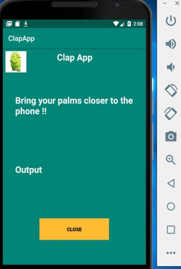
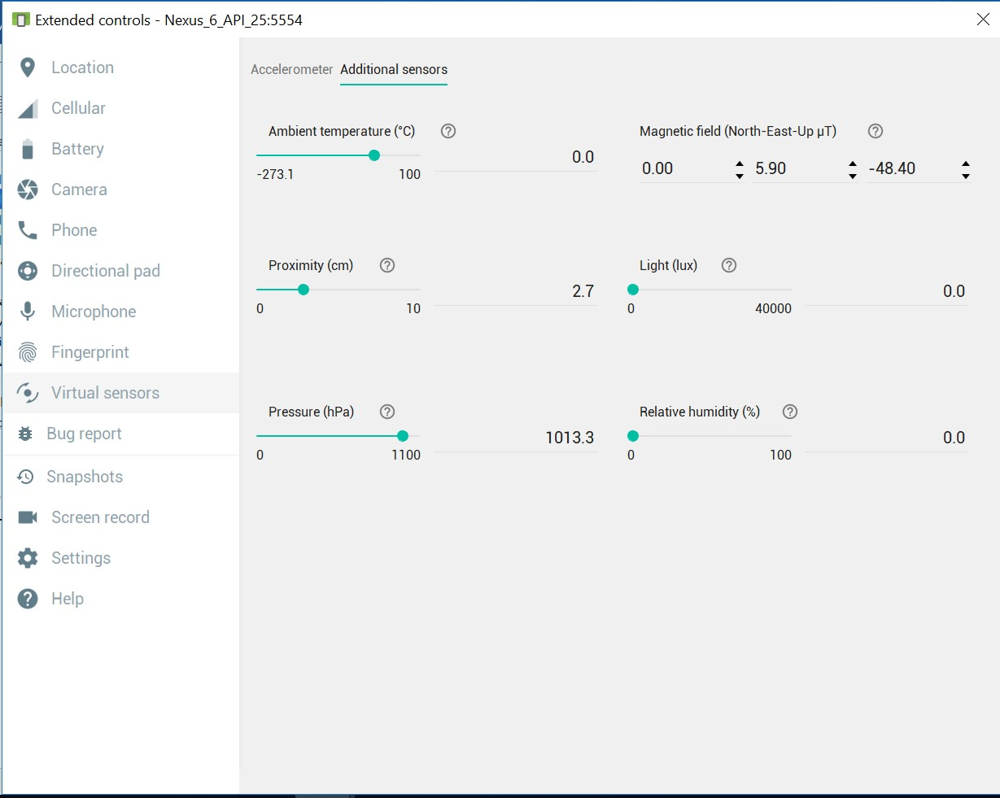
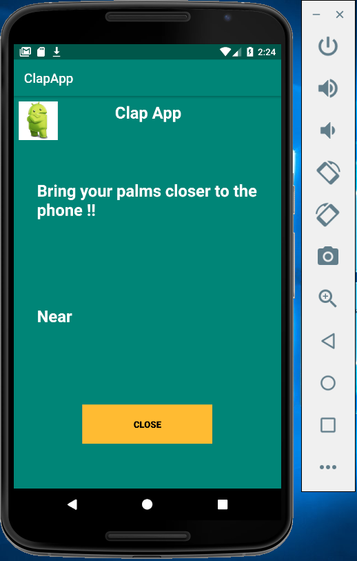
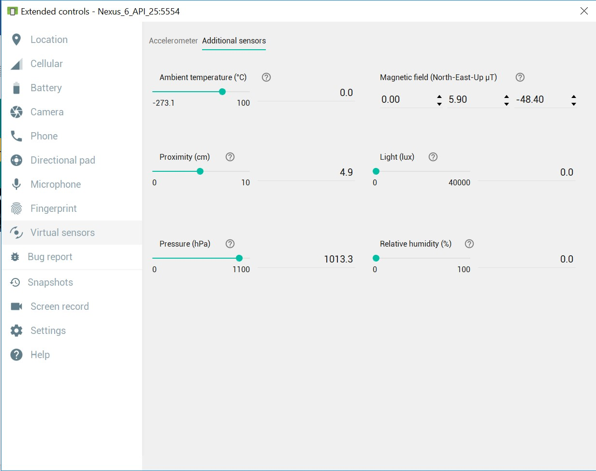
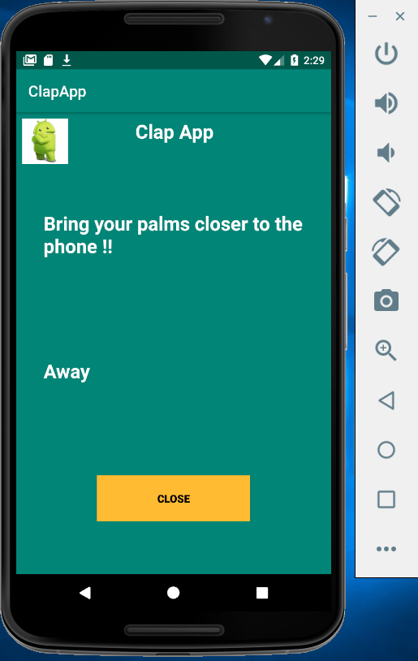

# Mobile Clap Application

The **Mobile Clap Application** is a simple Android application that simulates a clapping sound when the user's palms are brought close to the phone. The app utilizes the **Proximity Sensor** to detect the distance of the user's hands from the device and responds by playing or stopping a clapping sound accordingly. This README provides a summary of the app's features, usage, and technical details.

## Features

- Displays the message **"Bring your palms closer to the phone!!"** on the Home Screen.
- Detects proximity changes using the **Proximity Sensor**.
- Plays a clapping sound when the palms are close to the phone (proximity value below 3).
- Stops the clapping sound when the palms are away from the phone (proximity value above 3).
- Displays "Near" or "Away" based on the proximity status.
- Closes the app when the **Close** button is clicked.

## Folder Structure

The **clapsound.mp3** file used for the clapping sound is located under the `res/raw` folder:
```
res -> raw -> clapsound.mp3
```

## Installation and Setup

1. Clone the project to your local machine.
2. Open the project in **Android Studio**.
3. Place the `clapsound.mp3` file under the `res/raw` directory.

## How to Use the App

1. Launch the app to display the Home Screen with the message **"Bring your palms closer to the phone!!"**.

   

2. Under **Extended controls -> Virtual sensors -> Additional sensors** in the emulator, adjust the **proximity** value:
   - **Below 3**: When the proximity value is set to any value below 3, the app detects that the palms are close to the phone.
     - The output text changes to **"Near"**.
     - The clapping sound (`clapsound.mp3`) is played.

       

   - **Above 3**: When the proximity value is set to any value above 3, the app detects that the palms are away from the phone.
     - The output text changes to **"Away"**.
     - The clapping sound stops.

       

3. To close the application, click on the **Close** button.

   

4. The app exits, and the clapping simulation ends.

   

## Technical Details

- **Proximity Sensor**: The app uses the **PROXIMITY_SENSOR** to detect the distance between the device and the user's hands.
- **Sound Playback**: The clapping sound is implemented using the `clapsound.mp3` audio file located in `res/raw`.
- **Proximity Value Detection**:
  - **Below 3**: Indicates that the user's palms are close to the device, triggering the "Near" message and playing the clapping sound.
  - **Above 3**: Indicates that the user's palms are away from the device, triggering the "Away" message and stopping the clapping sound.

## Screenshots

1. **Home Screen with Prompt**  
   

2. **Proximity Sensor Detects Palms Near**  
   

3. **Proximity Sensor Detects Palms Away**  
   

4. **Close Button**  
   

5. **App Closed**  
   


